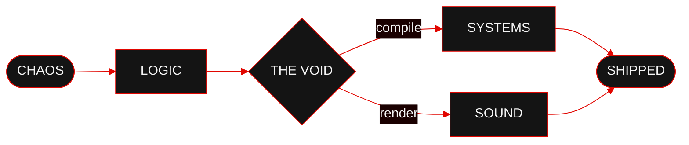
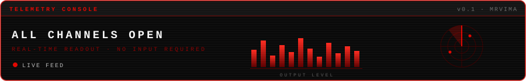

<!--
  ┌───────────────────────────────────────────────┐
  │  YOU FOUND THE SOURCE. THERE IS NOTHING HERE. │
  │  THAT IS THE POINT.                           │
  └───────────────────────────────────────────────┘
-->

<p align="center">
  
</p>

<h1 align="center">
  V&nbsp;Ø&nbsp;I&nbsp;D&nbsp;V&nbsp;I&nbsp;M&nbsp;A
</h1>

<p align="center">
  <b>VIMUKTHI HEWAGE</b><br/>
  <sub><code>EMBRACE THE NOTHING.</code> <code>BECOME EVERYTHING.</code></sub>
</p>

<p align="center">
  
</p>

<p align="center">
  
  
  
  
</p>

<p align="center">
  
</p>


## `▚ 01` &nbsp; ENGINEERING &amp; LOGIC

Software Engineering student at **Cardiff Metropolitan University**. I live in the seam between cold technical logic and loud, dark creative output — and I build in both directions.

```ts
const vima = {
  role:      "Software Engineering Student",
  school:    "Cardiff Metropolitan University",
  building:  ["FiveM Lua systems", "automation", "game mechanics"],
  alias:     "VØIDVIMA",
  motto:     "Embrace the nothing. Become everything.",
};
```

- 🎓 &nbsp;**Education** — Cardiff Met
- 🩸 &nbsp;**FiveM Development** — custom Lua scripts &amp; game mechanics
- ⚡ &nbsp;**Focus** — high-performance automation and game scripting

### `▚` CORE STACK

<p align="left">
  
  
  
  
  
  
</p>


## `▚ 02` &nbsp; CREATIVE IDENTITY // VØIDVIMA

When the compiler goes quiet, the speakers get loud. I craft dark, high-intensity soundscapes and the visuals that bleed out of them.

| SIGNAL | DESCRIPTION |
| :--- | :--- |
| **PHONK** | High-intensity drift beats and glitch aesthetics |
| **ENERGETIC ROCK** | Driving rhythms, distorted power |
| **SYNTHWAVE** | Retro-futuristic neon soundscapes |

### `▚` PRODUCTION RIG

<p align="left">
  
  
  
  
</p>


## `▚ 03` &nbsp; THE PIPELINE

Everything I make goes through the same machine.




## `▚ 04` &nbsp; FEATURED BUILDS

> ### ⛧ &nbsp;FiveM Cruise Control
> A high-performance Lua script for FiveM servers. Smooth speed-hold logic, clean native usage, zero bloat.
>
> `Lua` &nbsp;·&nbsp; `FiveM` &nbsp;·&nbsp; `Game Scripting`


## `▚ 05` &nbsp; SYSTEM TELEMETRY

<p align="center">
  
</p>

<details open>
<summary><b>&nbsp;▸&nbsp; CHANNEL 01</b> &nbsp;<code>VITALS</code></summary>

<br/>

<p align="center">
  <a href="https://github.com/MRVIMA?tab=followers"></a>
  <a href="https://github.com/MRVIMA?tab=repositories"></a>
</p>

<p align="center">
  <a href="https://github.com/MRVIMA"></a>
</p>

</details>

<details>
<summary><b>&nbsp;▸&nbsp; CHANNEL 02</b> &nbsp;<code>LANGUAGE SPECTRUM</code></summary>

<br/>

<p align="center">
  
  
</p>

</details>

<details>
<summary><b>&nbsp;▸&nbsp; CHANNEL 03</b> &nbsp;<code>UPTIME / STREAK</code></summary>

<br/>

<p align="center">
  
</p>

</details>

<details>
<summary><b>&nbsp;▸&nbsp; CHANNEL 04</b> &nbsp;<code>CONTRIBUTION WAVEFORM</code></summary>

<br/>

<p align="center">
  
</p>

</details>

<details>
<summary><b>&nbsp;▸&nbsp; CHANNEL 05</b> &nbsp;<code>TROPHY CABINET</code></summary>

<br/>

<p align="center">
  
</p>

</details>

<details>
<summary><b>&nbsp;▸&nbsp; CHANNEL 06</b> &nbsp;<code>PRODUCTIVE HOURS</code></summary>

<br/>

<p align="center">
  
  
</p>

<sub>Clock is set to UTC+5 &#183; Sri Lanka.</sub>

</details>


## `▚ 06` &nbsp; TRANSMISSIONS

<p align="center">
  <a href="https://instagram.com/voidvima"></a>
  <a href="#"></a>
  <a href="#"></a>
  <a href="#"></a>
  <a href="#"></a>
</p>


<details>
<summary></summary>

<br/>

<p align="center">
  
</p>

<p align="center">
  <b>The corridor splits. Two doors. No lights. Pick one.</b>
</p>

<details>
<summary><b>&nbsp;▸&nbsp; THE RED DOOR</b> &nbsp;<code>the loud one</code></summary>

<br/>

Sub-bass hits you in the sternum before your eyes adjust. This is where the beats get made — drift phonk at 3AM, distorted 808s, cowbells sharpened into weapons.

| | THE VOID LAWS — SIDE A |
| :---: | :--- |
| `I` | If it doesn't hit at 2AM, it doesn't hit. |
| `II` | Silence is a sound. Emptiness is a feature. |
| `III` | Distortion is honesty at volume. |

<sub>You leave with ringing ears and a new project file.</sub>


</details>

<details>
<summary><b>&nbsp;▸&nbsp; THE BLACK DOOR</b> &nbsp;<code>the quiet one</code></summary>

<br/>

One monitor. A cursor blinking in an empty Lua file. Somewhere a server is waiting for a script that doesn't exist yet.

| | THE VOID LAWS — SIDE B |
| :---: | :--- |
| `I` | Ship it broken before you ship it never. |
| `II` | Nothing is finished. Everything is versioned. |
| `III` | The bug was you. It's always you. |

<sub>You leave at sunrise. It compiled.</sub>


</details>

<details>
<summary><b>&nbsp;▸&nbsp; NEITHER. TURN BACK.</b> &nbsp;<code>too late</code></summary>

<br/>

<p align="center">

```
 ██╗   ██╗  ██████╗ ██╗██████╗
 ██║   ██║ ██╔═══██╗██║██╔══██╗
 ██║   ██║ ██║   ██║██║██║  ██║
 ╚██╗ ██╔╝ ██║   ██║██║██║  ██║
  ╚████╔╝  ╚██████╔╝██║██████╔╝
   ╚═══╝    ╚═════╝ ╚═╝╚═════╝
```

</p>

There was never a corridor.

```
01000101 01001101 01010000 01010100 01011001
```

<sub>Decode it, then pretend you saw nothing.</sub>


</details>

</details>


<p align="center">
  <sub><code>&gt; CODE IS POETRY. MUSIC IS LOGIC.</code></sub>
</p>

<p align="center">
  <sub>▓▓▒▒░░ &nbsp; E M B R A C E &nbsp; T H E &nbsp; N O T H I N G &nbsp; ░░▒▒▓▓</sub>
</p>
